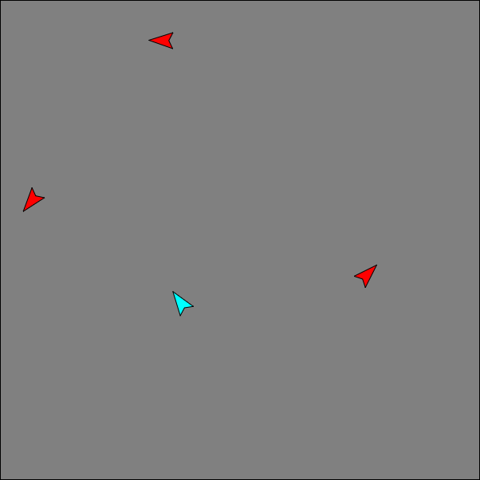

# node-space-game

A NodeJS multiplayer browser "game" using JavaScript OOP (pre-ES6) and WebSockets for bi-directional communication. The server and each client hold a version of the game state and these evolve independently, allowing for responsive gameplay. The server periodically broadcasts an authoritative version of the game state to keep all clients in sync. 

Pull the repo and run `npm install` in the `server` directory. To run the application, run `node app.js` and visit http://localhost:1337

 - app.js handles the web server stuff
 - GameServer.js handles the server-side version of the game-state
 - all other relevant JS is in public/scripts
 - main.js is the client-side entry point
 - GameClient.js handles the client-side version(s) of the game-state  

